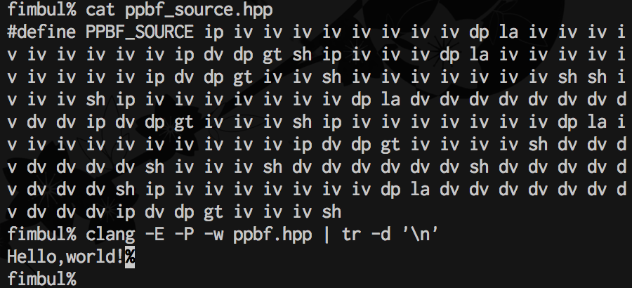

#概要  
ppbfはbrainfuckの言語仕様を簡略化した、Cプリプロセッサ上で解釈可能な言語及びその処理系である  
brainfuckの記述経験があれば、若干が異なるが容易に理解出来る仕様である

#ソースコードの記述  
実行コードはppbf_source.hpp内のPPBF_SOURCEに1命令ずつスペースで区切って記述する

#仕様
それぞれ値が0で初期化された3つのポインタからなり、はじめは1つ目のポインタを指している  
3つのポインタにはそれぞれ役割がある  
- 1つ目のポインタ - 値ポインタ  
- 2つ目のポインタ - フラグポインタ  
- 3つ目のポインタ - ラベルポインタ  

#命令  
- ip - ポインタをインクリメントする  
- vp - ポインタをデクリメントする  
- iv - ポインタの指す値をインクリメントする  
- dv - ポインタの指す値をデクリメントする  
- sh - ポインタの指す値を表示する  
- la - ラベルポインタに現在の命令位置を書き込む  
- gt - フラグポインタの値が0でなければラベルポインタの指す命令位置にジャンプする  

簡単なループの例を記述する  
ip iv iv iv iv iv dp la iv ip dv dp gt  
1. ip - ポインタをインクリメントして2つ目のポインタ(フラグポインタ)を指すようにする
2. iv iv iv iv iv - ポインタの指す値をインクリメントを5回実行してその値を5にする   
2. dp - 実行して1つ目のポインタ(値ポインタ)を指す  
3. la - 実行してラベルポインタに現在の命令位置をセットする  
4. iv - 実行して値ポインタの値をインクリメントする  
5. ip - 実行してポインタをインクリメントする(フラグポインタを指すようにする)  
6. dv - 実行してフラグポインタの値をデクリメントする  
7. dp - 実行してポインタをデクリメントする(値ポインタを指すようにする)  
8. gt - フラグポインタの値が0でなければラベルポインタの指す命令位置にジャンプする  
結果としてこの命令実行後、値ポインタの値は5となる

#実行  
clang -E -P -w ppbf.hpp | tr -d '\n' または gcc -E -P -w ppbf.hpp | tr -d '\n'   
プリプロセッサでソースコードを解釈し、tr -d '\n'で余計な改行を除去してやる

#実行例  
  
